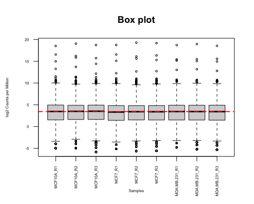
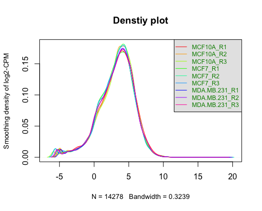
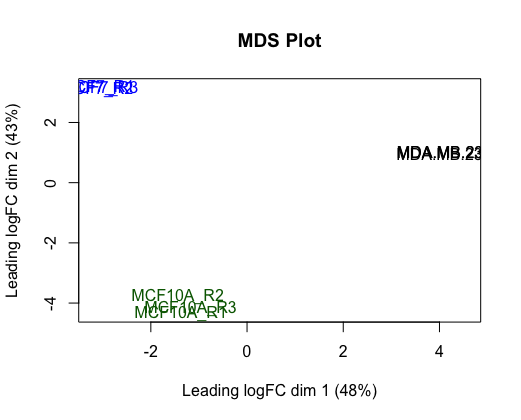

# Introduction

## Data Background and Objectives
In this report, we are going to continue work on cleaned GEO data GSE75168. The data target genetics and epigenetics change correlation with breast cancer sub-types, especially methlyation and acethylation of histone H3 lysine 4. Using a genome-wide ChIP-Seq approach, the data provide raw genomic count data of three human mammary cell lines: epithelial hyperplasia normal-basal sub-type (**MCF10A**), and two cancer sub-types: luminal (**MCF7**) and basal-like metastatic (**MDA-MB-231**) (Messier et al. 2016).

The objective for this assignemnt is to rank the genes according to their differential expression and to perform thresholded over-representation analysis to highlight dominant themes in your top set of genes.

## Load in required package

```{r, message = FALSE, warning=FALSE}
# install and loading required packages
if (!requireNamespace("BiocManager", quietly = TRUE))
  install.packages("BiocManager")
library(BiocManager)

if (!requireNamespace("GEOquery", quietly = TRUE))
  BiocManager::install("GEOquery")
library(GEOquery)

if (!requireNamespace("knitr", quietly = TRUE))
  install.packages("knitr")
library(knitr)

if (!requireNamespace("kableExtra", quietly = TRUE))
  install.packages("kableExtra")
library(kableExtra)

if (!requireNamespace("edgeR", quietly = TRUE))
  BiocManager::install("edgeR")
library(edgeR)

if (!requireNamespace("tidyr", quietly = TRUE))
  install.packages("tidyr")
library(tidyr)

if (!requireNamespace("Biobase", quietly = TRUE))
  install.packages("Biobase")
library(Biobase)

if (!requireNamespace("limma", quietly = TRUE))
  install.packages("limma")
library(limma)

if (!requireNamespace("ggrepel", quietly = TRUE))
  install.packages("ggrepel")
library(ggrepel)

if (!requireNamespace("ComplexHeatmap", quietly = TRUE))
  install.packages("ComplexHeatmap")
library(ComplexHeatmap)

if (!requireNamespace("circlize", quietly = TRUE))
  install.packages("circlize")
library(circlize)

if (!requireNamespace("gprofiler2", quietly = TRUE))
  install.packages("gprofiler2")
library(gprofiler2)

```

## Load Data
We saved our cleaned data output to a .csv file in A1. We will need to load the data file to use in our analysis for this assignment.

```{r, message = FALSE, warning=FALSE}
# load data
data <- read.csv(file = 'clean.csv', header = TRUE)

# view data
kable(data[1:10, ], format = 'html', caption = "<b>Table 1:</b> Overview of the gene expression data. Each row represent a different gene, in which the gene symbol is specified in column 'Gene")
```
<br />
The coverage of this data:
```{r, message = FALSE, warning=FALSE}
dim(data)
```

Remember from A1, we have two genes that could not map to HUGO symbol (ensembl_gene_id of ambiguous and no_feature), we will eliminate those two rows for future analysis.

```{r, message = FALSE, warning=FALSE}
# remove rows with NA value
data <- na.omit(data)
dim(data)
```

## Data normalization overview
The data had been cleaned and normalized in A1. Below are the box plot and density plot generated from A1 displaying the normalization of the data.

```{r, message = FALSE, warning=FALSE, fig.show="hold", out.width="50%", fig.cap="\\label{fig:figs}<b>Figure 1</b> Box plot of normalized data from A1."}

```
<br />
```{r, message = FALSE, warning=FALSE, fig.show="hold", out.width="50%", fig.cap="\\label{fig:figs}<b>Figure 2</b> Density plot of normalized data from A1."}

```


# Differential Gene Expression

## Define Model
The first step for differential gene expression would be define model.

We will first load in the sample group we defined in A1.
```{r message=FALSE, warning=FALSE}
sample_group <- read.csv(file = 'sample_group.csv', header = TRUE, row.names = 1)

# overview of the sample group
kable(sample_group, format = 'html', caption = "<b>Table 2:</b> Sample group informatic from A1.")

```
<br />

From the table and background information, we can see we have three human mammary cell lines: epithelial hyperplasia normal-basal sub-type **(MCF10A)**, and two cancer sub-types: luminal **(MCF7)** and basal-like metastatic **(MDA.MB.231)**, which each cell-line have three replicate.

Moreover, we also have the MDS plot from A1. Looking at the MDS plot, there is clustering among samples of the same cell lines, so cell lines appears to be an important factor in our model.
```{r, message = FALSE, warning=FALSE, fig.show="hold", out.width="50%", fig.cap="\\label{fig:figs}<b>Figure 3</b> MDS plot of normalized data from A1."}

```


Lets define our model using cell lines and perform differential expression analysis
```{r, message = FALSE, warning=FALSE}
# create a linear model
model_desgin <- model.matrix(~sample_group$cell_line)

# create data matrix
expression_matrix <- as.matrix(data[,2:10])
rownames(expression_matrix) <- data$Gene
colnames(expression_matrix) <- colnames(data)[2:10]

min_set <- ExpressionSet(assayData = expression_matrix)

# fit the data to model
fit <- lmFit(min_set, model_desgin)

# apply empirical Bayes to compute differential expression for above model
fit_bayes <- eBayes(fit, trend = TRUE)

```


Now we finish differential experession analysis and we can look at the top hits, together with  Benjamini-Hochberg correction for multiple hypothesis testing.

```{r, message = FALSE, warning=FALSE}
top_fit <- topTable(fit_bayes,
                         adjust.method = "BH",# Use BH correction
                         number = nrow(expression_matrix))

# assign gene symbols to the top_fit
output_hits <- merge(data[, c('Gene')],
                    top_fit,
                    by.y=0, by.x=1,
                    all.y=TRUE)

# sort hits in increasing p values
output_hits <- output_hits[order(output_hits$P.Value),]

kable(output_hits[1:10,], format = 'html', caption = "<b>Table 3:</b> Differnetial expression output. Each row represent a different gene, where the gene symbol is specified in column x. Column sample_group.cell_lineMCF7 is the logFC value for cell line MCF7 with control. Column sample_group.cell_lineMDA.MB.231 is the logFC value for cell line MDA-MD-231 with control.")

```

## Volcano Plot

Volcano plot is also a good visualization method of our gene differential expression. We can use volcano plot to visualize the de-regulated gene for two tumor cell lines: MCF7 and MDA-MB-231.

```{r, message = FALSE, warning=FALSE, fig.show="hold", out.width="50%", fig.cap="\\label{fig:figs}<b>Figure 4</b> Volcano plot of differential expression of MCF7 vs control."}
# color set we are going to use for the plot
colors <- c('red', 'black', 'blue')

# give each gene a de-regulate status group base on their expression.
output_hits_group <- output_hits
output_hits_group$group <- ifelse(output_hits$adj.P.Val < 0.01 & 
                                  output_hits$sample_group.cell_lineMCF7 > 0, 'Up-regulate', 
                                  ifelse(output_hits$adj.P.Val < 0.01 & 
                                    output_hits$sample_group.cell_lineMCF7 < 0, 'Down-regulate',
                                    'No-regulate'))

# plot
plot(output_hits_group$sample_group.cell_lineMCF7, -log10(output_hits_group$adj.P.Val), pch = 20,
     main = "Volcano plot of differential expression of MCF7",
     col = colors[factor(output_hits_group$group)],
     xlim = c(-10, 10),
     xlab = "logFC",
     ylab = "-log10(P-value)")
# add figure legend
legend("topright",
       legend = levels(factor(output_hits_group$group)),
       pch = 19,
       col = colors)
```

```{r, message = FALSE, warning=FALSE, fig.show="hold", out.width="50%", fig.cap="\\label{fig:figs}<b>Figure 5</b> Volcano plot of differential expression of MDA-MB-231 vs control."}
# color set we are going to use for the plot
colors <- c('red', 'black', 'blue')

# give each gene a de-regulate status group base on their expression.
output_hits_group <- output_hits
output_hits_group$group <- ifelse(output_hits$adj.P.Val < 0.01 & 
                                  output_hits$sample_group.cell_lineMDA.MB.231 > 0, 'Up-regulate', 
                                  ifelse(output_hits$adj.P.Val < 0.01 & 
                                    output_hits$sample_group.cell_lineMDA.MB.231 < 0, 'Down-regulate',
                                    'None-regulate'))

# plot
plot(output_hits_group$sample_group.cell_lineMDA.MB.231, -log10(output_hits_group$adj.P.Val), pch = 20,
     main = "Volcano plot of differential expression of MDA-MB-231",
     col = colors[factor(output_hits_group$group)],
     xlim = c(-10, 10),
     xlab = "logFC",
     ylab = "-log10(P-value)")
# add figure legend
legend("topright",
       legend = levels(factor(output_hits_group$group)),
       pch = 19,
       col = colors)
```
## Heat Map

We can also visualize our hit use a heatmap. 

```{r, message = FALSE, warning=FALSE, out.width="50%", fig.cap="\\label{fig:figs}<b>Figure 6</b> Heat map of all gene expression across all samples. The heat map was coloured based on expression of each gene, where red is up-regulated and blue is down-regulated. On the bottom of the heatmap, the name for each sample is shown."}
# create a matrix of our top-hit data to ensure constant data type
heatmap_matrix <- data[,2:10]
rownames(heatmap_matrix) <- data$Gene
colnames(heatmap_matrix) <- colnames(data[, 2:10])

# scale each gene and center around mean
heatmap_matrix <- t(scale(t(heatmap_matrix)))

# assign heatmap colors
if(min(heatmap_matrix) == 0){
heatmap_col = colorRamp2(c( 0, max(heatmap_matrix)),
                         c( "white", "red"))
} else {
  heatmap_col = colorRamp2(c(min(heatmap_matrix), 0,
                             max(heatmap_matrix)), c("blue", "white", "red"))
}

# plot
current_heatmap <- Heatmap(as.matrix(heatmap_matrix),
                           show_row_dend = TRUE,
                           show_column_dend = TRUE,
                           col=heatmap_col,
                           show_column_names = TRUE,
                           show_row_names = FALSE,
                           show_heatmap_legend = TRUE)

current_heatmap


```


## Discussion Questions
**Calculate p-values for each of the genes in your expression set. How many genes were significantly differentially expressed? What thresholds did you use and why?**

```{r, message = FALSE, warning=FALSE}
length(which(output_hits$P.Value < 0.05))
```

```{r, message = FALSE, warning=FALSE}
length(which(output_hits$P.Value < 0.01))
```
There are 8058 genes that are significantly differentially expressed.

I choose threshold of 0.01 for p-value because is use standard value of 0.05, around 80% of the gene are significantly expressed. Thus, the p-value need to be more stringent.

**Multiple hypothesis testing - correct your p-values using a multiple hypothesis correction method. Which method did you use? And Why? How many genes passed correction?**

```{r, message = FALSE, warning=FALSE}
length(which(output_hits$adj.P.Val < 0.01))
```
There are 7265 genes that are significantly differentially expressed using adjust P-value. This is a fair amount (which is around half of all the genes) so the threshold does not need to be adjust.

The correction method I used is Benjamini-Hochberg correction because this method method uses False Discovery Rate, which is not at conservative like Bonferroni correction. Moreover, BH correction also suit our large sample size and have a greater power compare to other method in our cases (Haynes, W. 2013).

**Show the amount of differentially expressed genes using an MA Plot or a Volcano plot. Highlight genes of interest.**

Volcano plot is displayed in figure 4 and 5. From the plot, we can observe there are even number of up-regulate and down-regulate genes.

**Visualize your top hits using a heatmap. Do you conditions cluster together? Explain why or why not.**

For three different cell-lines, we can see similarities in the genes' differential expression among the same cell-line, i.e. genes that are up-regulate in one replicate will also be up-regulate in other replicates in the same cell-line. This agrees to what we saw in our MDS plot in the introduction section, which samples of the same cell-line cluster.

# Thresholded over-representation analysis
To perform the gene enrichment analysis, we will use g:Profiler to perform the gene enrichment analysis. We used FDR for correction. In our previous course journal entry assignment, we used GO Biological Process (GO:BP), Reactome (REAC), and WikiPathways (WP) - we will be using these sources in this section.

## MCF7 VS MCF10A
We will first divide our data into up-regulated genes and down-regulated genes and examine them individually.
Lets first start with the up-regulated genes.

**Up-Regulate**
```{r, message = FALSE, warning=FALSE}
# select up regulate group
up_regulate <- output_hits[output_hits$adj.P.Val < 0.01 & output_hits$sample_group.cell_lineMCF7 > 0, ]

# Up-regulated
up_result <- gost(query = rownames(up_regulate), organism = "hsapiens",
    exclude_iea = TRUE, correction_method = "fdr", sources = c("GO:BP", "REAC", "WP"))

# Limit term size
up_result <- data.frame(term_name = up_result$result$term_name[up_result$result$term_size <
    500 & up_result$result$term_size > 1], 
    term_id = up_result$result$term_id[up_result$result$term_size <
    500 & up_result$result$term_size > 1], 
    source = up_result$result$source[up_result$result$term_size <
    500 & up_result$result$term_size > 1])

# Visualize our results
kable(up_result[1:10, ], format = "html", caption = "<b>Table 4:</b> Top 10 terms of up-regulated gene in MCF7 VS MCF10A across platform GO:BP, REAC, WP.")
```


Total number of terms we got:
```{r, message = FALSE, warning=FALSE}
nrow(up_result)
```


**Down-Regulate**
```{r, message = FALSE, warning=FALSE}
# define down regulate group
down_regulate <- output_hits[output_hits$adj.P.Val < 0.01 & output_hits$sample_group.cell_lineMCF7 < 0, ]

# down-regulated
down_result <- gost(query = rownames(down_regulate), organism = "hsapiens",
    exclude_iea = TRUE, correction_method = "fdr", sources = c("GO:BP", "REAC", "WP"))

# Limit term size
down_result <- data.frame(term_name = down_result$result$term_name[down_result$result$term_size <
    500 & down_result$result$term_size > 1], 
    term_id = down_result$result$term_id[down_result$result$term_size <
    500 & down_result$result$term_size > 1], 
    source = down_result$result$source[down_result$result$term_size <
    500 & down_result$result$term_size > 1])

# Visualize our results
kable(down_result[1:10, ], format = "html", caption = "<b>Table 5:</b> Top 10 terms of down-regulated gene in MCF7 VS MCF10A across platform GO:BP, REAC, WP.")
```

Total number of terms we got:
```{r, message = FALSE, warning=FALSE}
nrow(down_result)
```

## MDA.MB.231 VS MCF10A
We will do the same for this cell line as well.

**Up-Regulate**
```{r, message = FALSE, warning=FALSE}
# define up regulate group
up_regulate <- output_hits[output_hits$adj.P.Val < 0.01 & output_hits$sample_group.cell_lineMDA.MB.231 > 0, ]

# Up-regulated
up_result <- gost(query = rownames(up_regulate), organism = "hsapiens",
    exclude_iea = TRUE, correction_method = "fdr", sources = c("GO:BP", "REAC", "WP"))

# Limit term size
up_result <- data.frame(term_name = up_result$result$term_name[up_result$result$term_size <
    500 & up_result$result$term_size > 1], 
    term_id = up_result$result$term_id[up_result$result$term_size <
    500 & up_result$result$term_size > 1], 
    source = up_result$result$source[up_result$result$term_size <
    500 & up_result$result$term_size > 1])

# Visualize our results
kable(up_result[1:10, ], format = "html", caption = "<b>Table 6:</b> Top 10 terms of up-regulated gene in MDA.MB.231 VS MCF10A across platform GO:BP, REAC, WP.")
```

Total number of terms we got:
```{r, message = FALSE, warning=FALSE}
nrow(up_result)
```

**Down-Regulate**
```{r, message = FALSE, warning=FALSE}
# define down regulate group
down_regulate <- output_hits[output_hits$adj.P.Val < 0.01 & output_hits$sample_group.cell_lineMDA.MB.231 < 0, ]

# down-regulated
down_result <- gost(query = rownames(down_regulate), organism = "hsapiens",
    exclude_iea = TRUE, correction_method = "fdr", sources = c("GO:BP", "REAC", "WP"))

# Limit term size
down_result <- data.frame(term_name = down_result$result$term_name[down_result$result$term_size <
    500 & down_result$result$term_size > 1], 
    term_id = down_result$result$term_id[down_result$result$term_size <
    500 & down_result$result$term_size > 1], 
    source = down_result$result$source[down_result$result$term_size <
    500 & down_result$result$term_size > 1])

# Visualize our results
kable(down_result[1:10, ], format = "html", caption = "<b>Table 7:</b> Top 10 terms of down-regulated gene in MDA.MB.231 VS MCF10A across platform GO:BP, REAC, WP.")
```

Total number of terms we got:
```{r, message = FALSE, warning=FALSE}
nrow(down_result)
```


## All genes
Now we are going to examine the whole list without considering differential expression.
```{r, message = FALSE, warning=FALSE}

all_result <- gost(query = rownames(output_hits), organism = "hsapiens",
    exclude_iea = TRUE, correction_method = "fdr", sources = c("GO:BP", "REAC", "WP"))

# Limit term size
all_result <- data.frame(term_name = all_result$result$term_name[all_result$result$term_size <
    500 & all_result$result$term_size > 1], 
    term_id = all_result$result$term_id[all_result$result$term_size <
    500 & all_result$result$term_size > 1], 
    source = all_result$result$source[all_result$result$term_size <
    500 & all_result$result$term_size > 1])

# Visualize our results
kable(down_result[1:10, ], format = "html", caption = "<b>Table 8:</b> Top 10 terms of whole gene set across platform GO:BP, REAC, WP.")
```

Total number of terms we got:
```{r, message = FALSE, warning=FALSE}
nrow(all_result)
```


## Discussion Questions
**Which method did you choose and why?**

I choose to use gprofiler 2 package, which is R version for website G:Profiler. The reason I choose this package is because I am already familair with this package from lecture and a journal assignment we did before. Also, the platform is convinent and powerful to use, they have frequent their data frequently and give user freedom where we can adjust term size and correction method we want to use.


**What annotation data did you use and why? What version of the annotation are you using?**

The annotation data I use are GO Biological Process (2024-01-17), Reactome (2024-1-25), and WikiPathways (2024-01-01) because in combination, those three process cover majority of the biological pathway related to human disease.

**How many genesets were returned with what thresholds?**

I use adjust p-value of 0.01 and term size between 1 and 500.

For **MCF7 VS MCF10A**, I got 1090 and 721 for up-regulate and down regulate respectively. For **MDA.MB.231 VS MCF10A**, I got 1091 and 698 for up-regulate and down regulate respectively. For all gene set regardless of differential expression, I got 4284 terms.

**Run the analysis using the up-regulated set of genes, and the down-regulated set of genes separately. How do these results compare to using the whole list (i.e all differentially expressed genes together vs. the up-regulated and down regulated differentially expressed genes separately)?**

Using the whole list, I got way more result than using wither of up-regulated set of genes or the down-regulated set of genes. Also, using the whole list, the result include more general area than the result generate by differential expressed gene set. Also, in both cell-line, there are more terms for up-regulate and down-regulate, suggest more up-regulate gene are biological significant than down-regulate genes.

# Interpretation

**Do the over-representation results support conclusions or mechanism discussed in the original paper?**

Yes. For MCF7 cell line, the orginal paper suggest genes are differentially marked are involved in cell adhesion and cell-surface mediated signaling, which align with our search result in table 4 of cell adhesion. Moreover, orginal paper also suggest large number of genes within the Estrogen Receptor Alpha (ESR1) and Estrogen Receptor Beta (ESR2) pathways, which those two are critical for the diverse effects of estrogen in the body, including reproductive health, bone metabolism, cardiovascular function. In our result in table 4, we can observe a top term of circulatory and blood regulation. For MDA-MB-231 cell line, original paper suggest a relation to regulation of endocrine related epigenetic response. In table 6, we can see terms associate with different hormonal cellular response to organic compound and modification of peptide (Messier et al, 2016).


**Can you find evidence, i.e. publications, to support some of the results that you see. How does this evidence support your results.**

In Charafe-Jauffret et al's paper, suggest role of methylation of MCF7 cell line contribute to cell-surface mediated signal, which support our result of involvement of MCF7 cell line cell adhesion(Charafe-Jauffret et al, 2006). Moreover, regulation of estrogen involed pathway of this same cell line is also suggest by Deschenes et al, which also support our search result of involvement of cardiovascular function (Deschenes et al, 2007).


# Reference

Haynes, W. (2013). Benjamini–Hochberg Method. In: Dubitzky, W., Wolkenhauer, O., Cho, KH., Yokota, H. (eds) Encyclopedia of Systems Biology. Springer, New York, NY. https://doi.org/10.1007/978-1-4419-9863-7_1215

Morgan M, Ramos M (2023).BiocManager: Access the Bioconductor Project Package Repository. R package version 1.30.22,https://CRAN.R-project.org/package=BiocManager.

Davis, S. and Meltzer, P. S. GEOquery: a bridge between the Gene Expression Omnibus (GEO) and BioConductor. Bioinformatics, 2007, 14, 1846-1847
Xie Y (2023).knitr: A General-Purpose Package for Dynamic Report Generation in R. R package version 1.45, https://yihui.org/knitr/.

Zhu H (2021).kableExtra: Construct Complex Table with ‘kable’ and Pipe Syntax. R package version 1.3.4,https://github.com/haozhu233/kableExtra,http://haozhu233.github.io/kableExtra/.

Robinson MD, McCarthy DJ and Smyth GK (2010). edgeR: a Bioconductor package for differential expression analysis of digital gene expression data. Bioinformatics 26, 139-140

Wickham H, Vaughan D, Girlich M (2023).tidyr: Tidy Messy Data. R package version 1.3.0,https://CRAN.R-project.org/package=tidyr.

Huber W, Carey VJ, Gentleman R, Anders S, Carlson M, Carvalho BS, Bravo HC, Davis S, Gatto L, Girke T, Gottardo R, Hahne F, Hansen KD, Irizarry RA, Lawrence M, Love MI, MacDonald J, Obenchain V, Ole's AK, Pag'es H, Reyes A, Shannon P, Smyth GK, Tenenbaum D, Waldron L, Morgan M (2015). “Orchestrating high-throughput genomic analysis with Bioconductor.”Nature Methods,12(2), 115–121.http://www.nature.com/nmeth/journal/v12/n2/full/nmeth.3252.html.

Ritchie ME, Phipson B, Wu D, Hu Y, Law CW, Shi W, Smyth GK (2015). “limma powers differential expression analyses for RNA-sequencing and microarray studies.”Nucleic Acids Research,43(7), e47.doi:10.1093/nar/gkv007.

Slowikowski K (2024).ggrepel: Automatically Position Non-Overlapping Text Labels with 'ggplot2'. https://ggrepel.slowkow.com/, https://github.com/slowkow/ggrepel.

Gu Z, Eils R, Schlesner M (2016). “Complex heatmaps reveal patterns and correlations in multidimensional genomic data.” Bioinformatics. doi:10.1093/bioinformatics/btw313.

Gu Z, Gu L, Eils R, Schlesner M, Brors B (2014). “circlize implements and enhances circular visualization in R.”Bioinformatics,30, 2811-2812.

Kolberg L, Raudvere U, Kuzmin I, Vilo J, Peterson H (2020). “gprofiler2– an R package for gene list functional enrichment analysis and namespace conversion toolset g:Profiler.” F1000Research, 9 (ELIXIR)(709). R package version 0.2.3.

Liis Kolberg, Uku Raudvere, Ivan Kuzmin, Priit Adler, Jaak Vilo, Hedi Peterson: g:Profiler—interoperable web service for functional enrichment analysis and gene identifier mapping (2023 update) Nucleic Acids Research, May 2023; doi:10.1093/nar/gkad347.

Ruth Isserlin, Course Lectures (2024)

Messier TL, Gordon JA, Boyd JR, Tye CE, Browne G, Stein JL, Lian JB, Stein GS. Histone H3 lysine 4 acetylation and methylation dynamics define breast cancer subtypes. Oncotarget. 2016 Feb 2;7(5):5094-109. doi: 10.18632/oncotarget.6922. PMID: 26783963; PMCID: PMC4868673.

Charafe-Jauffret E, Ginestier C, Monville F, Finetti P, Adelaide J, Cervera N, Fekairi S, Xerri L, Jacquemier J, Birnbaum D, Bertucci F. Gene expression profiling of breast cell lines identifies potential new basal markers. Oncogene. 2006; 25:2273-2284.

Deschenes J, Bourdeau V, White JH, Mader S. Regulation of GREB1 transcription by estrogen receptor alpha through a multipartite enhancer spread over 20 kb of upstream flanking sequences. J Biol Chem. 2007; 282:17335-17339.