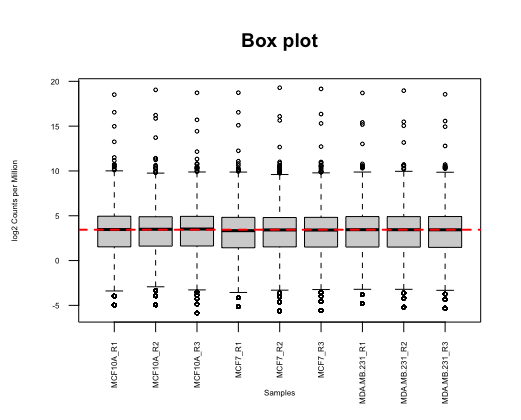
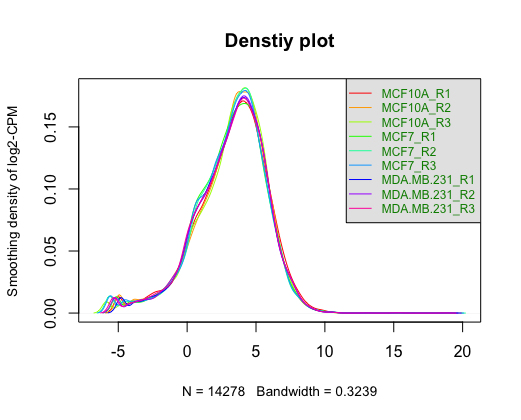
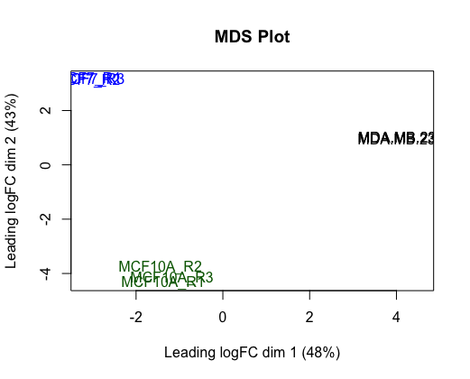

---
title: 'BCB420 Assignment 3: Data set Pathway and Network Analysis'
author: "Wenzhu Ye"
date: "`r Sys.Date()`"
output: 
  html_document: 
    toc: true
    toc_float: true
    toc_depth: 3
---

# Introduction

## Background Information

In this report, we are going to continue work on GEO data GSE75168. The data target genetics and epigenetics change correlation with breast cancer sub-types, especially methlyation and acethylation of histone H3 lysine 4. Using a genome-wide ChIP-Seq approach, the data provide raw genomic count data of three human mammary cell lines: epithelial hyperplasia normal-basal sub-type (**MCF10A**), and two cancer sub-types: luminal (**MCF7**) and basal-like metastatic (**MDA-MB-231**) (Messier et al. 2016).

The objective for this project is to perform Non-thresholded Gene set Enrichment Analysis and Visualize my Gene set Enrichment Analysis in Cytoscape.

## Load in required package

```{r, message = FALSE, warning=FALSE}
# install and loading required packages
if (!requireNamespace("BiocManager", quietly = TRUE))
  install.packages("BiocManager")
library(BiocManager)


if (!requireNamespace("knitr", quietly = TRUE))
  install.packages("knitr")
library(knitr)

if (!requireNamespace("kableExtra", quietly = TRUE))
  install.packages("kableExtra")
library(kableExtra)

if (!requireNamespace("tidyr", quietly = TRUE))
  install.packages("tidyr")
library(tidyr)

if (!requireNamespace("fgsea", quietly = TRUE)) {
  BiocManager::install("fgsea")
}
library(fgsea)

if (!requireNamespace("tibble", quietly = TRUE)) {
  BiocManager::install("tibble")
}
library(tibble)

if (!requireNamespace('data.table', quietly = TRUE)) {
  install.packages('data.table')
}
library(data.table)


```

## Summary on previous progress

### A1 - Data cleaning

In A1, we take the raw data from GEO and perform data cleaning, normalization, and mapped HUGO symbols. The initial raw data set contain 20575 genes. After cleaning, we are left with 13292 genes.

To view the data:

We saved our cleaned data output to a .csv file in A1.

```{r, message = FALSE, warning=FALSE}
# load data
data <- read.csv(file = 'clean.csv', header = TRUE)

# view data
kable(data[1:10, ], format = 'html', caption = "<b>Table 1:</b> Overview of the gene expression data. Each row represent a different gene, in which the gene symbol is specified in column 'Gene")
```

To view the sample group:

```{r message=FALSE, warning=FALSE}
sample_group <- read.csv(file = 'sample_group.csv', header = TRUE, row.names = 1)

# overview of the sample group
kable(sample_group, format = 'html', caption = "<b>Table 2:</b> Sample group informatic from A1.")

```

Where we got three replicate for each of the cell line.

Below are the box plot and density plot generated from A1 displaying the normalization of the data.

```{r, message = FALSE, warning=FALSE, fig.show="hold", out.width="50%", fig.cap="\\label{fig:figs}<b>Figure 1</b> Box plot of normalized data from A1."}

```
<br />
```{r, message = FALSE, warning=FALSE, fig.show="hold", out.width="50%", fig.cap="\\label{fig:figs}<b>Figure 2</b> Density plot of normalized data from A1."}

```

Moreover, we also have the MDS plot from A1.

```{r, message = FALSE, warning=FALSE, fig.show="hold", out.width="50%", fig.cap="\\label{fig:figs}<b>Figure 3</b> MDS plot of normalized data from A1."}

```

### A2 - Gene differential analysis

In A2, we performed gene differential analysis on A1 cleaned data, and store the result in a .csv file. To view the result:

```{r, message = FALSE, warning=FALSE}
# load data
ranked_gene <- read.csv(file = 'diff_expression.csv', header = TRUE)

# view data
kable(ranked_gene[1:10, ], format = 'html', caption = "<b>Table 3:</b> Differnetial expression output. Each row represent a different gene, where the gene symbol is specified in column Gene. Column sample_group.cell_lineMCF7 is the logFC value for cell line MCF7 with control. Column sample_group.cell_lineMDA.MB.231 is the logFC value for cell line MDA-MD-231 with control.")
```

To visualize the result via heatmap:

```{r, message = FALSE, warning=FALSE, fig.show="hold", out.width="50%", fig.cap="\\label{fig:figs}<b>Figure 4</b> Heat map of all gene expression across all samples. The heat map was coloured based on expression of each gene, where red is up-regulated and blue is down-regulated. On the bottom of the heatmap, the name for each sample is shown."}

```


# Non-thresholded Gene set Enrichment Analysis

We will be perform GSEA using package fgsea.

```{r, message = FALSE, warning=FALSE}
# load in the gene set
pathway <- gmtPathways("Human_GOBP_AllPathways_noPFOCR_no_GO_iea_April_01_2024_symbol.gmt")
```


## MCF7 VS MCF10A


### Up-regulate

```{r, message = FALSE, warning=FALSE}
# select up regulate group
up_regulate <- ranked_gene[ranked_gene$adj.P.Val < 0.01 & ranked_gene$sample_group.cell_lineMCF7 > 0, ]

# conduct gsea
gseaResults <- fgsea::fgsea(pathways = pathway, 
                            stats = deframe(up_regulate), 
                            maxSize = 200, 
                            minSize = 15, 
                            nperm = 1000)

gseaResults <- as_tibble(gseaResults) 
gseaResults <- gseaResults[order(gseaResults$NES, decreasing = TRUE),]

# save result
fwrite(gseaResults, file="fgsea_MCF7_pos.tsv", sep="\t", sep2=c("", " ", ""))

# view data
kable(gseaResults[1:10, ], format = 'html', caption = "<b>Table 4:</b> Enriched gene sets of the upregulated genes in MCF7 VS MCF10A cell line", row.names=FALSE) %>% kable_styling()
```

The number fo gene sets we found:

```{r, message = FALSE, warning=FALSE}
nrow(gseaResults)
```

### Down-regulate

```{r, message = FALSE, warning=FALSE}
# select up regulate group
down_regulate <- ranked_gene[ranked_gene$adj.P.Val < 0.01 & ranked_gene$sample_group.cell_lineMCF7 < 0, ]

# conduct gsea
gseaResults <- fgsea::fgsea(pathways = pathway, 
                            stats = deframe(down_regulate), 
                            maxSize = 200, 
                            minSize = 15, 
                            nperm = 1000)

gseaResults <- as_tibble(gseaResults) 
gseaResults <- gseaResults[order(gseaResults$NES, decreasing = TRUE),]

# save result
fwrite(gseaResults, file="fgsea_MCF7_neg.tsv", sep="\t", sep2=c("", " ", ""))

# view data
kable(gseaResults[1:10, ], format = 'html', caption = "<b>Table 5:</b> Enriched gene sets of the downregulated genes in MCF7 VS MCF10A cell line", row.names=FALSE) %>% kable_styling()
```

The number fo gene sets we found:

```{r, message = FALSE, warning=FALSE}
nrow(gseaResults)
```

## MDA.MB.231 VS MCF10A


### Up-regulate

```{r, message = FALSE, warning=FALSE}
# select up regulate group
up_regulate <- ranked_gene[ranked_gene$adj.P.Val < 0.01 & ranked_gene$sample_group.cell_lineMDA.MB.231 > 0, ]

# conduct gsea
gseaResults <- fgsea::fgsea(pathways = pathway, 
                            stats = deframe(up_regulate), 
                            maxSize = 200, 
                            minSize = 15, 
                            nperm = 1000)

gseaResults <- as_tibble(gseaResults) 
gseaResults <- gseaResults[order(gseaResults$NES, decreasing = TRUE),]

# view data
kable(gseaResults[1:10, ], format = 'html', caption = "<b>Table 6:</b> Enriched gene sets of the upregulated genes in MDA.MB.231 VS MCF10A cell line", row.names=FALSE) %>% kable_styling()
```

The number fo gene sets we found:

```{r, message = FALSE, warning=FALSE}
nrow(gseaResults)
```

### Down-regulate

```{r, message = FALSE, warning=FALSE}
# select up regulate group
down_regulate <- ranked_gene[ranked_gene$adj.P.Val < 0.01 & ranked_gene$sample_group.cell_lineMDA.MB.231 < 0, ]

# conduct gsea
gseaResults <- fgsea::fgsea(pathways = pathway, 
                            stats = deframe(down_regulate), 
                            maxSize = 200, 
                            minSize = 15, 
                            nperm = 1000)

gseaResults <- as_tibble(gseaResults) 
gseaResults <- gseaResults[order(gseaResults$NES, decreasing = TRUE),]

# view data
kable(gseaResults[1:10, ], format = 'html', caption = "<b>Table 7:</b> Enriched gene sets of the downregulated genes in MDA.MB.231 VS MCF10A cell line", row.names=FALSE) %>% kable_styling()
```

The number fo gene sets we found:

```{r, message = FALSE, warning=FALSE}
nrow(gseaResults)
```
## Discussion Questions
**What method did you use? What genesets did you use? Make sure to specify versions and cite your methods.**

The method I choose to use is GSEA becuase we have already cover this in previoud journal entry assignmnet. In the journal entry assignment, I perform GSEA in the official app, but for this assignmnet, I try to perform GSEA directly from R. I choose to use fgsea package because it is easy to use and have sort runtime (Korotkevich et al. 2016). 
The geneset I use is from Bader lab, updated on April, 1, 2024 `Human_GOBP_AllPathways_noPFOCR_no_GO_iea_April_01_2024_symbol.gmt`. This geneset include human GO biological process, no IEA and pathways (Merico et al, 2010).

**Summarize your enrichment results.**

For cell line **MCF7 VS MCF10A**, using threshold of adjust P value < 0.01, we got 1948 gene sets enriched for up-regulated gene, and 1850 gene sets enriched for down-regulated gene. In this cell line, we can pathways associate with transportation across membrane, various receptor like estrogen receptor, and post-translational modification like methylation (Table 4, Table 5).

For cell line **MDA.MB.231 VS MCF10A**, using threshold of adjust P value < 0.01, we got 2285 gene sets enriched for up-regulated gene, and 1518 gene sets enriched for down-regulated gene.  In this cell line, we can see pathways associate with different signaling pathway like activation of B cell, selenocystein synthesis,and ribosomalprotein synthesis (Table 6, Table 7).

**How do these results compare to the results from the thresholded analysis in Assignment #2. Compare qualitatively. Is this a straight forward comparison? Why or why not?**

For cell line **MCF7 VS MCF10A**, using the same set of data and adjust p value threshold, majority of the result are about regulation of cell adhesion and circulatory process, which does not agree with the result we got using GSEA. For cell line **MDA.MB.231 VS MCF10A**, we still get regulation of cell adhesion and circulatory process, but we do also get result that related to cell signaling pathway like regulation of apototic signalling pathway. Relate back to the activation of B cell pathway we got in previous question, we know that activation of B cell lead to B-cell receptor-induced apotosis, which our finding in this assignment and A2 agree.
One reason for the non-alignment is because the gene sets number we got for A2 is way less (1090 for up-regulate and 721 for down-regulate), thus, it is possible that the threshold over-representation analysis we did in A2 did not cover the pathway we got for non-threshold over-representation analysis. 

# Visualize your Gene set Enrichment Analysis in Cytoscape

We will ve using EnrichmentMap app (Version 3.3.6) (Merico et al, 2010) in Cytoscape (Version 3.10.2) (Shannon et al, 2003).

## Create an enrichment map - how many nodes and how many edges in the resulting map? What thresholds were used to create this map? Make sure to record all thresholds. Include a screenshot of your network prior to manual layout.

The parameter we use:

Analysis Type: `GSEA`

Enrichments Pos: `fgsea_MCF7_pos.tsv` (from previous section)

Enrichments Neg: `fgsea_MCF7_neg.tsv` (from previous section)

GMT: `Human_GOBP_AllPathways_noPFOCR_no_GO_iea_April_01_2024_symbol.gmt`

Ranks: `ranked.rnk.txt` (ranked list from A2)

FDR q-value cutoff: 0.05

p-value cutoff: 0.05

Parse baderlab names in GMT file: Yes

```{r, message = FALSE, warning=FALSE, fig.show="hold", out.width="50%", fig.cap="\\label{fig:figs}<b>Figure 5</b> Initial Enrichment Map. Each node is represent a gene set, and is coloured based on their differential experssion. Coloured red represent upregulated and blue represent downregulated. Relative node sizes correspond to relative gene set size. Edges represent overlap between nodes. "}

```
In total, there are 1045 nodes and 5474 edges.

## Annotate your network - what parameters did you use to annotate the network. If you are using the default parameters make sure to list them as well.

I use AutoAnnotate app (Version 1.4.1) (Kucera et al, 2016) in Cytoscape to annotate the network. 

The parameter I use:

**Cluster Options**

Use clusterMaker App

Cluster algorithm: MCL Cluster

Edge weight column: similarity_coefficient

**Label Options**

Label Column: GS_DESCR

Label Algorithm: WordCloud: Adjacent Words 

Max word per label: 3

Minimum word occurrence: 1

Adjacent word bonus: 8


```{r, message = FALSE, warning=FALSE, fig.show="hold", out.width="50%", fig.cap="\\label{fig:figs}<b>Figure 6</b> Annotated Enrichment Map. Yellow circule represent a cluster of gene sets, and the size of the circle is the relative size of clusters. Each node is represent a gene set, and is coloured based on their differential experssion. Coloured red represent upregulated and blue represent downregulated. Relative node sizes correspond to relative gene set size. Edges represent overlap between nodes. "}

```

## Make a publication ready figure - include this figure with proper legends in your notebook.

We change the parameter in AutoAnnote to select the option of Layout netword to prevent cluster overlap, and exclude them that are too little. We got a publication-ready figure:

```{r, message = FALSE, warning=FALSE, fig.show="hold", out.width="50%", fig.cap="\\label{fig:figs}<b>Figure 7</b> Publication ready Enrichment Map. Yellow circule represent a cluster of gene sets, and the size of the circle is the relative size of clusters. Each node is represent a gene set, and is coloured based on their differential experssion. Coloured red represent upregulated and blue represent downregulated. Relative node sizes correspond to relative gene set size. Edges represent overlap between nodes. "}
knitr::include_graphics("public.png")
```

```{r, message = FALSE, warning=FALSE, fig.show="hold", out.width="50%", fig.cap="\\label{fig:figs}<b>Figure 8</b> Legend for figure 7."}
knitr::include_graphics("legend.png")
```

## Collapse your network to a theme network. What are the major themes present in this analysis? Do they fit with the model? Are there any novel pathways or themes?

To collapse my netword, I choose the collapse all option in AutoAnnoate menu and CoSE option in layout. Here is the result I got:

```{r, message = FALSE, warning=FALSE, fig.show="hold", out.width="50%", fig.cap="\\label{fig:figs}<b>Figure 8</b> Theme for Enrichment Map. Yellow circule represent a cluster of gene sets, and the size of the circle is the relative size of clusters. Each node is represent a gene set, and is coloured based on their differential experssion. Coloured red represent upregulated and blue represent downregulated. Relative node sizes correspond to relative gene set size. Edges represent overlap between nodes."}

```

Although it is not clear from the screenshot, the major theme present are verapamil action pathway (44 gene sets), ximelagatran action pathway (20 gene sets) and homeostasis blood coagulation (15 gene sets), all the remaining theme have gene sets less than 10.  The result fit with our model where our result is related to cardiac pathway, like mentioned in A2. Out of the three major theme, there is a novel theme ximelagatran action pathway.


# Interpretation and detailed view of results

**Do the enrichment results support conclusions or mechanism discussed in the original paper? How do these results differ from the results you got from Assignment #2 thresholded methods**

Yes. For the MCF7 cell line, the original paper suggests genes that are differentially marked are involved in cell adhesion and cell-surface mediated signalling, which align with our search result in non-threshold GSEA of transportation across membranes. Lots of our results display pathways related to transportation among cell surfaces (Table 4, Table 5), which is an importance factor in both cell adhesion and cell-surface mediate signalling. The result aligns with A2 since using the threshold method, we found a pathway for cell adhesion. Moreover, the main themes we found in the enrichment map are the verapamil action pathway and homeostasis blood coagulation (Figure 7), which are both related to cardiac function. In the original paper, they suggest a large number of genes within the Estrogen Receptor Alpha (ESR1) and Estrogen Receptor Beta (ESR2) pathways, which two are critical for the diverse effects of estrogen in the body, including reproductive health, bone metabolism, cardiovascular function, which align with our result. Our result of cardiac function aligns with the original paper and with our finding in A2 which the top terms include circulatory and blood regulation.

For the MDA-MB-231 cell line, the original paper suggests a relation to the regulation of endocrine-related epigenetic response, which aligns with our result on selenocysteine synthesis, and ribosomalprotein synthesis (Table 6, Table 7). Moreover, our A2 result suggests that the de-regulation of this cell line affects the cell signalling pathway like the regulation of apoptotic signalling pathway. In our analysis, we can see pathways like different signalling pathways like activation of B cell, correspond with A2 since we know that activation of B cell leads to B-cell receptor-induced apoptosis (Messier et al, 2016).

**Can you find evidence, i.e. publications, to support some of the results that you see. How does this evidence support your result?**

Same as A2, in Charafe-Jauffret et al’s paper, suggest role of methylation of MCF7 cell line contribute to cell-surface mediated signal, which support our result of involvement of MCF7 cell in transportation among cell surfance (Charafe-Jauffret et al, 2006). Moreover, regulation of estrogen involed pathway of this same cell line is also suggest by Deschenes et al, which also support our search result of involvement of cardiovascular function (Deschenes et al, 2007).

# References

Messier TL, Gordon JA, Boyd JR, Tye CE, Browne G, Stein JL, Lian JB, Stein GS. Histone H3 lysine 4 acetylation and methylation dynamics define breast cancer subtypes. Oncotarget. 2016 Feb 2;7(5):5094-109. doi: 10.18632/oncotarget.6922. PMID: 26783963; PMCID: PMC4868673.

Morgan M, Ramos M (2023).BiocManager: Access the Bioconductor Project Package Repository. R package version 1.30.22,https://CRAN.R-project.org/package=BiocManager.

Davis, S. and Meltzer, P. S. GEOquery: a bridge between the Gene Expression Omnibus (GEO) and BioConductor. Bioinformatics, 2007, 14, 1846-1847 Xie Y (2023).knitr: A General-Purpose Package for Dynamic Report Generation in R. R package version 1.45, https://yihui.org/knitr/.

Zhu H (2021).kableExtra: Construct Complex Table with ‘kable’ and Pipe Syntax. R package version 1.3.4,https://github.com/haozhu233/kableExtra,http://haozhu233.github.io/kableExtra/.

Robinson MD, McCarthy DJ and Smyth GK (2010). edgeR: a Bioconductor package for differential expression analysis of digital gene expression data. Bioinformatics 26, 139-140

Wickham H, Vaughan D, Girlich M (2023).tidyr: Tidy Messy Data. R package version 1.3.0,https://CRAN.R-project.org/package=tidyr.

Korotkevich, Gennady, Vladimir Sukhov, Nikolay Budin, Boris Shpak, Maxim N Artyomov, and Alexey Sergushichev. 2016. “Fast Gene Set Enrichment Analysis.” BioRxiv, 060012.

Shannon P, Markiel A, Ozier O, Baliga NS, Wang JT, Ramage D, Amin N, Schwikowski B, Ideker T. Cytoscape: a software environment for integrated models of biomolecular interaction networks. Genome Res. 2003 Nov;13(11):2498-504. doi: 10.1101/gr.1239303. PMID: 14597658; PMCID: PMC403769.

Korotkevich G, Sukhov V, Sergushichev A (2019). “Fast gene set enrichment analysis.” bioRxiv. doi:10.1101/060012, http://biorxiv.org/content/early/2016/06/20/060012.

Müller K, Wickham H (2023). tibble: Simple Data Frames. https://tibble.tidyverse.org/, https://github.com/tidyverse/tibble.

Barrett T, Dowle M, Srinivasan A, Gorecki J, Chirico M, Hocking T (2024). _data.table: Extension of `data.frame`_. R package
  version 1.15.4, https://CRAN.R-project.org/package=data.table.
  
Merico, D., Isserlin, R., Stueker, O., Emili, A., & Bader, G. D. (2010). Enrichment map: a network-based method for gene-set enrichment visualization and interpretation. PloS one, 5(11), e13984. https://doi.org/10.1371/journal.pone.0013984

Kucera M, Isserlin R, Arkhangorodsky A, Bader GD. AutoAnnotate: A Cytoscape app for summarizing networks with semantic annotations. F1000Res. 2016 Jul 15;5:1717. doi: 10.12688/f1000research.9090.1. PMID: 27830058; PMCID: PMC5082607.

Charafe-Jauffret E, Ginestier C, Monville F, Finetti P, Adelaide J, Cervera N, Fekairi S, Xerri L, Jacquemier J, Birnbaum D, Bertucci F. Gene expression profiling of breast cell lines identifies potential new basal markers. Oncogene. 2006; 25:2273-2284.

Deschenes J, Bourdeau V, White JH, Mader S. Regulation of GREB1 transcription by estrogen receptor alpha through a multipartite enhancer spread over 20 kb of upstream flanking sequences. J Biol Chem. 2007; 282:17335-17339.


